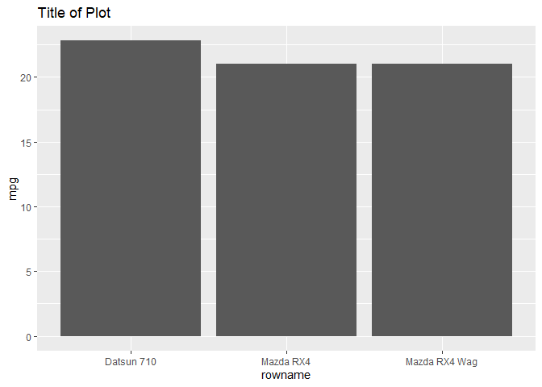
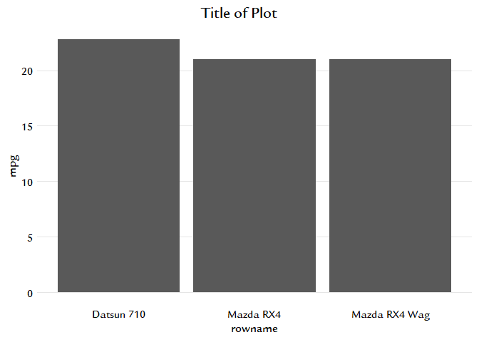

<!-- README.md is generated from README.Rmd. Please edit that file -->

# hwdsb

<!-- badges: start -->
<!-- badges: end -->

The goal of hwdsb is to provide simple tools to manage data sources and
produce analyses & reports useful for school-board data.

## Installation

You can install the development version of hwdsb from
[GitHub](https://github.com/) with:

``` r
# install.packages("devtools")
devtools::install_github("dkanters/hwdsb")
```

## Example

\##This is a basic example which shows how to apply the
hwdsb_ggplot_theme to a ggplot

\###Below is the plot without any formatting from the function

``` r
library(hwdsb)
mtcars |>
  head(3) |>
  tibble::rownames_to_column() |>
  ggplot2::ggplot(ggplot2::aes(x = rowname, y = mpg)) +
  ggplot2::geom_col() +
  ggplot2::labs(title = "Title of Plot") 
```

 \###Adding
the sixth line defines theme parameters (colours, fonts) for the ggplot
object.

``` r
mtcars |>
  head(3) |>
  tibble::rownames_to_column() |>
  ggplot2::ggplot(ggplot2::aes(x = rowname, y = mpg)) +
  ggplot2::geom_col() +
  ggplot2::labs(title = "Title of Plot") + 
  hwdsb_ggplot_theme()
```



What is special about using `README.Rmd` instead of just `README.md`?
You can include R chunks like so:

``` r
summary(cars)
#>      speed           dist       
#>  Min.   : 4.0   Min.   :  2.00  
#>  1st Qu.:12.0   1st Qu.: 26.00  
#>  Median :15.0   Median : 36.00  
#>  Mean   :15.4   Mean   : 42.98  
#>  3rd Qu.:19.0   3rd Qu.: 56.00  
#>  Max.   :25.0   Max.   :120.00
```

You’ll still need to render `README.Rmd` regularly, to keep `README.md`
up-to-date. `devtools::build_readme()` is handy for this.

You can also embed plots, for example:


In that case, don’t forget to commit and push the resulting figure
files, so they display on GitHub and CRAN.
